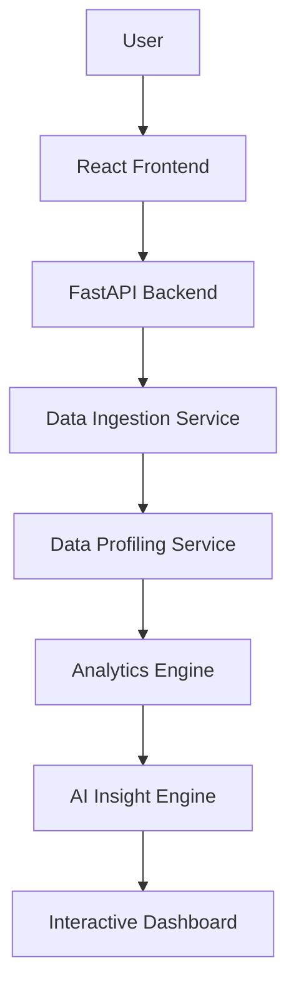

# System Architecture

InsightIQ uses a modern decoupled architecture, separating a React-based single-page application from a Python/FastAPI data processing backend.

## High-Level Flow

## Components

### Frontend (React + Vite + TypeScript)
- **UI Framework**: Tailwind CSS for rapid, clean styling.
- **State Management**: React Context or Zustand for dataset states.
- **Visualization**: Recharts for dynamic, interactive data plotting.
- **Communication**: Axios for REST API calls to the backend.

### Backend (Python + FastAPI)
- **API Framework**: FastAPI for high performance, automatic OpenAPI documentation, and async support.
- **Data Processing**: Pandas and NumPy form the core of the analytics engine, handling profiling, cleaning, and transformations.
- **Machine Learning**: Scikit-learn for basic anomaly detection (e.g., Isolation Forests) and Statsmodels for forecasting.
- **Database ORM**: SQLAlchemy for structured data storage (metadata, user settings).

### Data Pipeline Flow

### AI Layer & SQL Tutor
The AI layer is abstracted. Instead of sending raw datasets to an LLM (which is inefficient and insecure), the backend sends structured metadata, statistical summaries, and schema definitions.
For the **SQL Tutor**, the AI generates the query and a structured JSON response containing:
- Line-by-line explanations
- Complexity score
- Conceptual tags
- Alternative approaches

## Security Considerations
- **Data Sanitization**: All uploaded files are validated.
- **SQL Injection**: Using SQLAlchemy parameterized queries. Arbitrary user SQL is not executed directly without safeguards.
- **Secrets Management**: API keys and DB credentials are strictly managed via `.env` files.

## Deployment Strategy (Future)
- **Containerization**: Docker and Docker Compose for easy environment replication.
- **Database**: Managed PostgreSQL instance.
- **Background Jobs**: Redis and Celery for heavy data processing tasks to avoid blocking the main API thread.
